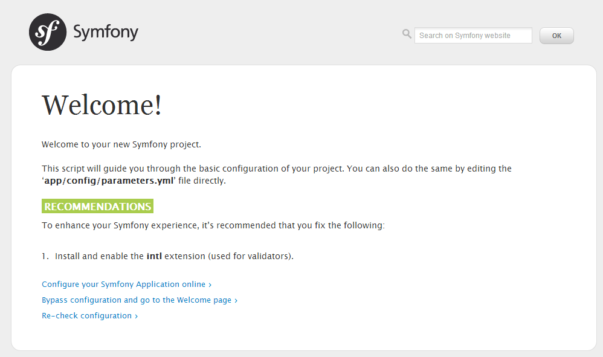

# 安装Symfony2 #

## 获取Symfony2 ##

有好几种方式可以安装Symfony2：直接下载zip包安装，通过Composer安装，通过Symfony Installer来安装。这里我们用Symfony Installer来安装，这也是目前官方唯一推荐的方式。这个Symfony Installer其实是个PHP程序，你需要先把它安装到你的操作系统里，而且要求你的PHP版本至少是5.4；如果你的PHP版本不够，那就只能用其它两种方式下载安装了。

先安装Symfony Installer到操作系统中，并使它有执行权限。
```shell
$ sudo curl -LsS http://symfony.com/installer -o /usr/local/bin/symfony
$ sudo chmod a+x /usr/local/bin/symfony
```

回到自己的用户主目录，用Symfony Installer来建立一个新项目，这个新项目就放在~/Symfony目录下

```shell
$ cd
$ symfony new Symfony
```

你会看到一个安装进度条。完成后进入Symfony下。并且通过Symfony2的命令行工具启动PHP内置的web服务器（这个内置服务器只有在PHP5.4或以上才有，如果你的版本不够的话，你需要一个诸如Nginx或者Apache这样的web服务器来继续本教程）。我们加上`&`使服务器在后台运行。它默认监听localhost的8000端口。

```shell
$ cd Symfony
$ php app/console server:run &
```

## 检查你的PHP版本和配置 ##

Symfony2对你的PHP版本和配置是有一些要求的。比如，它只能运行在版本5.3.9或以上的PHP中。
为了检查下你的PHP环境是否兼容Symfony2，请在浏览器上输入这个地址http://localhost:8000/config.php。如果你的PHP版本够的话，你应该会看到下面这张图。



如果出现不兼容的情况（尤其是由PHP版本的问题），Symfony2会要求你先解决那个问题才能继续。如果它只是给你一些建议（译者注：比如上图里建议安装intl扩展），你可以不理会，因为它们是可选的，但我还是建议你把它们也解决一下。

Symfony2需要在某些目录下有写权限。具体说来，你需要在调整下`app/cache`和`app/logs`的权限。首先你先清空下这两个目录：

```shell
$ rm -rf app/cache/* -rf
$ rm -rf app/logs/*
```

接着，如果你的系统支持`chmod +a`，执行下面的命令来设定权限：

```shell
$ HTTPDUSER=`ps aux | grep -E '[a]pache|[h]ttpd|[_]www|[w]ww-data|[n]ginx' | grep -v root | head -1 | cut -d\  -f1`
$ sudo chmod +a "$HTTPDUSER allow delete,write,append,file_inherit,directory_inherit" app/cache app/logs
$ sudo chmod +a "`whoami` allow delete,write,append,file_inherit,directory_inherit" app/cache app/logs
```

如果你执行以上代码时遇到问题（`chmod +a`并不是所有系统都支持），请执行下面的setfacl命令：

```shell
$ HTTPDUSER=`ps aux | grep -E '[a]pache|[h]ttpd|[_]www|[w]ww-data|[n]ginx' | grep -v root | head -1 | cut -d\  -f1`
$ sudo setfacl -R -m u:"$HTTPDUSER":rwX -m u:`whoami`:rwX app/cache app/logs
$ sudo setfacl -dR -m u:"$HTTPDUSER":rwX -m u:`whoami`:rwX app/cache app/logs
```

如果你连setfacl也用不了的话，你就直接定义这两个目录的权限吧：

```shell
$ HTTPDUSER=`ps aux | grep -E '[a]pache|[h]ttpd|[_]www|[w]ww-data|[n]ginx' | grep -v root | head -1 | cut -d\  -f1`
$ chmod 777 -R app/cache
$ chmod 777 -R app/cache
```

好了，我们回到主题。

你现在就可以运行Symfony2程序了，恭喜你啊！请进入http://localhost:8000/app_dev.php/app/example，你会看到页面显示“Homepage.”。

## 检查命令行上的PHP ##

接下去我们会时不时执行命令行上的PHP程序来生成代码或管理数据库。这些程序可以给你节省很多时间（Symfony2总是围绕着这个目标！），所以我们得检查下是否可以在命令行上执行PHP。别担心，我会一步一步告诉你怎么使用它们。:smile:

一般而言，在类Unix系统上，PHP安装好后，命令行应该已经可执行了。打开终端，输入以下命令：

```shell
$ php -v
```

如果你看到终端输出了PHP版本和其它一些信息，那就说明已经好了。如果有问题的话，请查看下你是否安装了相关的包（译者注：如果是通过yum来安装的，这个包通常叫`php-cli`；其它包管理器里可能叫`php5-cli`）。

好了，到此你的工作站已经就绪，可以开始Symfony2的开发了！

## 本章小结 ##

- 框架的主要目标是提高开发人员的工作效率。
- 和CMS不一样的是，框架是面向开发人员的，不是面向计算机小白的。
- 学习一门框架就是一份投资：开始时需要你的投入，但你会在长远的时间里获得回报！
- Symfony2是一个非常流行的PHP框架，而且是法国制造，企业里用得很多。


