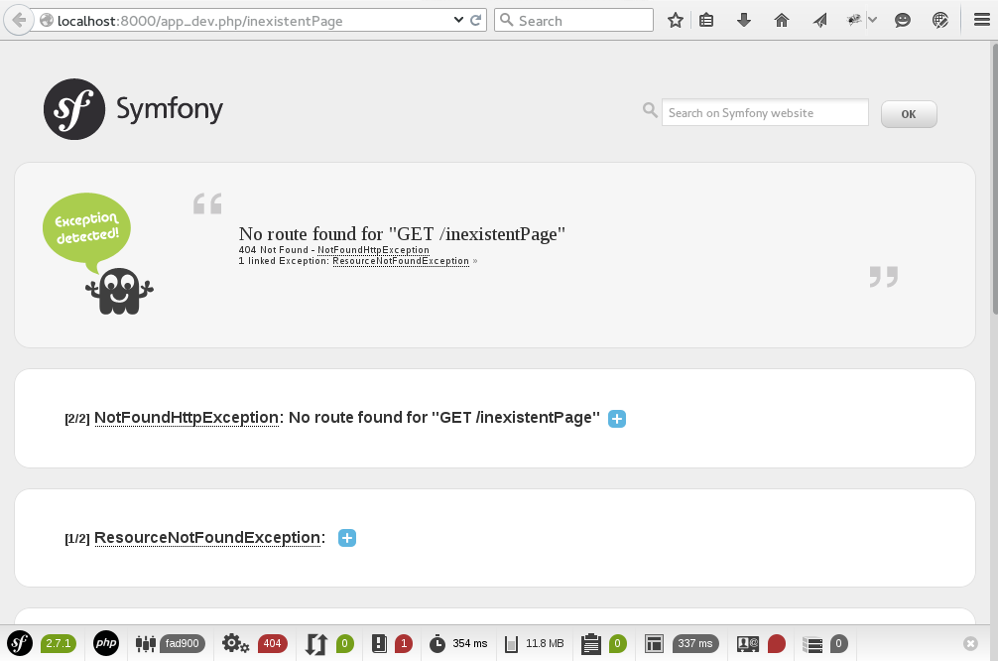
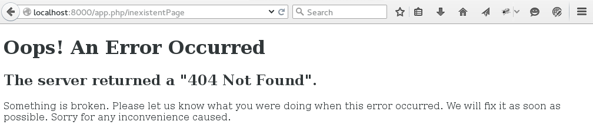

# 文件的组织结构 #

我们刚刚下载了一大堆文件，但还不知道它们是做什么用的。现在是时候来说明一下了。

## 目录列表 ##

进入到你Symfony安装的目录（`$HOME/Symfony`），你会看到除了好几个说明升级用的文件外，这里的文件并不多，但有几个目录。事实上，基本上所有的文件都放置在这些目录下，所以我们要来看看这些目录都是干什么的。主要有4个目录：

- `app`
- `src`
- `vendor`
- `web`

### `app`目录 ###

这个目录包含了关于你网站的一切...除了它的源代码。你可能会说这听起来很奇怪。其实这是为了把网站源代码从其余一切中分离出来。网站源代码只负责网站的业务逻辑，而这个所谓的“其余一切”呢，就是`app`目录了。具体来说，它包含了网站的配置，缓存，日志等等。这些都是和整个网站有关的，而源代码会根据功能划分成不同部分。对Symfony2来说，一个互联网应用和一个网站是一回事，只是换个词而已。这个`app`就是application的缩写。

### `src`目录 ###

在这才是存放源代码的目录！我们大部分时间都是花在这里。在这个目录里，我们把代码组织为一个或多个bundle。bundle是我们应用程序的基石，我们一会再回过来看它是什么东西。

你会看到这个目录不是空的。Symfony2安装时已经在这里放置了一个叫AppBundle的目录。

### `vendor`目录 ###

这个目录包含了你应用程序依赖的外部库。你可以浏览下这个目录，你会看到诸如`Doctrine`，`Twig`，`SwiftMailer`这样的库。

> _库到底是什么东西？_
> 一个库是一个完成特定功能的黑盒，我们可以在自己的代码里使用它。比如，`SwiftMailer`这个库可以用来发送邮件。我们不知道它是怎么运作的（“黑盒”原则），但我们知道怎么使用它：所以我们只要学习怎么调用这个库就可以轻易地发送邮件了。

### `web`目录 ###

这个目录包含了所有会发送给网站访客的静态文件：图片，CSS和JavaScript等等。它也包含了前端控制器（`app.php`），我们马上会谈到它。

事实上，这个目录是唯一可以让网站用户看到的目录，其它的目录都不应该让访客访问到（这些其它目录只和你有关，和你的用户无关）。所以你会在`app`和`src`下看到`.htaccess`文件，它们用来禁止外部访问目录里的内容（译者注：`.htaccess`只对Apache有效，更好的方法是在生产环境中把网站对应的document root设为Symfony2的`web`目录）。

### 记住这些 ###

请记住我们大多数时间都花在`src`里了，我们会在这里写我们的bundle。我们也会修改不少`app`里的内容来配置网站。当我们安装第三方bundle或者库的时候，它们会被存放在`vendor`里。

## 前端控制器 ##

### 定义 ###

前端控制器（front controller）是你的应用程序入口。每个页面的浏览都会经过它。你一定看过`index.php`在形如`index.php?page=blog`这样的URL里使用，这里`index.php`就是一个前端控制器了。在Symfony2里，前端控制器是`web`目录里的两个文件：`app.php`和`app_dev.php`。

> _为什么要有2个前端控制器？刚才还不是说这是控制所有页面的唯一文件吗？_
> 你的想法没错，但那只是一种经典情况！现在我们使用Symfony2，我们的目标是让开发更容易，所以Symfony2提供了专供访客使用的前端控制器`app.php`，又提供了专供开发人员使用的另一个前端控制器`app_dev.php`。这两个拿来即可用的控制器定义了两种工作环境。

### 两种工作环境 ###

根据网站使用者的不同情况来作出不同的回应，这是提供两种工作环境的目的：

- 开发人员线需要关于页面的信息来更好地开发。如果页面出现错误，他们需要所有相关的信息来方便地纠错。他们不需要页面加载特别快。
- 一般访客不需要关于页面的信息。如果出现页面错误，他们并不想知道哪里出了问题，他们只会返回到前面的页面。不过他们希望页面可以尽快加载。

你开到区别了吧？每种人的需求不同，Symfony2会满足这些不同的群体。这就是它提供两种或更多种工作环境的原因。

- 称为`dev`的开发环境使用`app_dev.php`作为前端控制器。开发人员应该总是使用这个控制器。
- 称为`prod`的生产环境使用`app.php`作为前端控制器。

来试试吧！用浏览器访问http://localhost:8000/app_dev.php/app/example，你会看到屏幕下方又一个工具栏，它包含了对开发有用的大量信息。如果你访问http://localhost:8000/app.php/app/example，就不会看到这个工具栏。

我们来看看在开发环境中出现错误时的情况，打开一个不存在的页面http://localhost:8000/app_dev.php/inexistentPage，你会看到类似下图的页面：

再来看看生产环境中的错误情况，打开http://localhost:8000/app.php/inexistentPage，你会看到类似下图的页面：

两者区别很明显吧。生产环境下的页面只是说“页面找不到”，而开发模式下却显示了有关错误情况的大量信息，这些信息对纠错是必不可少的。

所以，在本课程接下去的部分，我们都会使用开发环境，也就是用`app_dev.php`这个前端控制器。当然，你网站上线后，大家来访问时，他们用的将会是生产环境。不过目前我们还没有到那一步。

> _既然生产环境里不显示错误信息，我们怎么知道线上网站到底是否出现了错误和什么错误？_
> 好问题！如果你的一位访客触发了网站上的一个错误，他不会看到任何相关消息。你也看不到，但这样的话排查起错误来就很麻烦了。不过尽管这些错误没有被显示在浏览器里，它们却被存储在服务器的文件里。请打开`app/logs/prod.log`文件看下，它包含了生产环境下请求的大量信息，包括错误情况的信息。

### 具体来说，前端控制器控制什么东西呢？ ###

真是个好问题！想要知道的话，最好就是打开`app.php`看一下，你会看到它也没干太多事情。事实上，前端控制器的目的不是要去_做_什么事情，而只是作为我们应用程序的入口。它的工作仅仅只是调用Symfony2的内核（Kernel），对它说：“我刚刚收到一个请求，请你把它转化成一个应答吧。”

这里我们可以把前端控制器看成是属于我们的一个文件（存储在`web`目录下），而把Symfony2的内核看成是一个黑盒（存储在`vendor`目录下）。看一下如何使用我们遇到的第一个Symfony2组件：我们只是把对于请求的管理委托给了内核。当然，内核也需要我们告诉它执行哪些代码，但我们刚刚看到的一些东西都已经在内核管理之下了：错误信息管理，屏幕下方增加工具栏，等等。我们都还啥都没做，却已经占得先机了。
