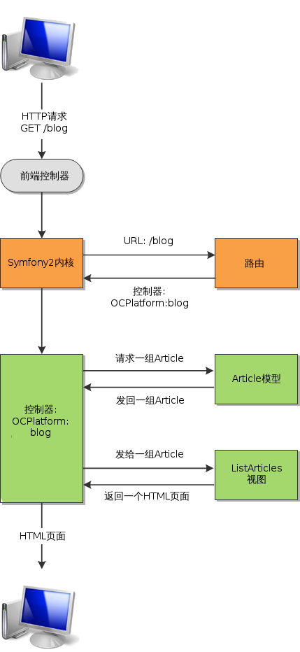

# 框架的设计 #

我们刚刚看了Symfony2里文件是如何组织的，现在我们来看看Symfony2里的代码是如何执行的。

## MVC架构 ##

你一定听说过MVC的概念，Symfony2也遵循这种架构。我不会涉及太多细节但我们来看看它大概是什么样子。

MVC意思是模型（Model）/视图（View）/控制器（Controller），这是一种在网站开发中广泛使用的解耦方式，因为它会合适地分层：

- 控制器：它的角色就是对网站用户发送的HTTP请求作出应答。它这一层会对用户的请求进行分析和处理。控制器包含了网站逻辑，但它也仅仅是调用其它组件：模型和视图。具体到一个例子，比如一个控制器会获取当前用户的信息，验证该用户有修改某篇文件的权限，获取这篇文章，最后调取编辑文章的表单页面。没什么太复杂的地方，用几个`if`判断就能搞定了。
- 模型：它的角色是管理你的数据和内容。还是举上面那个文章的例子，当我说控制器“获取这篇文章”的时候，其实它会调用Article模型，并且告诉它：“给我ID为5的那篇文章”。只有Article模型才知道如何获取这篇文章：通常是发送一个SQL语句到数据库，但也可能是从文本文件获取，或者其它你想要的方式。最终，模型使得控制器能够操作这些文章，但同时控制器却不用理会这些文章是怎么被存储和管理的。模型扮演一个抽象层的角色。
- 视图：它的角色是显示页面。还是用这个文章的例子，其实不是控制器来显示编辑文章的表单，它只不过调用了相关的视图。如果我们有一个叫Form的视图，那它应该包含这个表单用到的HTML标签。最后，控制器只不过显示出这个视图的内容，它并不知道该视图里有些什么标签。把视图和控制器分开可以让前端工程师和PHP工程师工作在不同的文件上，从而避免冲突。

总结下，你现在应该清楚了，控制器只包含非常简单的代码，因为它所做的无非就是调用模型和视图，把具体的工作分配给它们。这有点像乐团的指挥，他只是拿着一根棒挥来挥去，而所有的声音都来自乐团里音乐家们所使用的复杂乐器。

## Symfony2里的HTTP请求处理流程 ##

为了图示目前为止我们所讨论过的所有概念，我画了一张Symfony2里处理一个HTTP请求的完整流程图。

以下对上图的文字说明：

1. 网站访客请求`/blog`页面；
2. 前端控制器收到请求，加载内核（Kernel）并把请求传递给它；
3. 内核询问路由：`/blog`这个URL对应到哪个控制器？路由也是Symfony2的一个组件，它用来把URL对应到控制器（或反过来），我们在之后的章节中会专门学习。路由做完对应后，告知Kernel它应该执行`OCPlatform:Blog`这个控制器；
4. 于是内核执行这个控制器。该控制器让Article模型获从数据库里取一组article数据，然后把它们发给ListArticles视图，让它生成HTML页面并返回。这些都完成后，控制器把最终的HTML页面发回给访客（译者注：其实更细节的过程是控制器把HTML页面发回个内核，内核再发回给访客）。

我用不同的颜色来标注了我们需要参与开发的部分。控制器，模型和视图用绿色，这些是需要我们自己去_开发_的。内核和路由用桔黄色，这些是我们需要去_配置_的。前端控制器是灰色的，我们一点都不用去改它。

