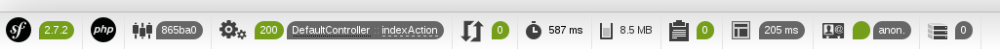

# 创建我们的bundle #

## 一切皆bundle ##

再次提醒下：在Symfony2里，你网站的每一部分都是属于某一个bundle。要建立我们的第一个网页，我们首先要见习我们的第一个bundle。别担心，用生成器来建立bundle小菜一碟，看着吧！

### 执行正确的命令 ###

正如上一节里我们做过的，现在来执行一个命令：

``` shell
$ php app/console generate:bundle
```

### 1.选择命名空间 ###

Symfony2会问该bundle的命名空间是什么。

``` shell
$ php app/console generate:bundle
                                            

  Welcome to the Symfony2 bundle generator


Your application code must be written in bundles. This command helps
you generate them easily.

Each bundle is hosted under a namespace (like Acme/Bundle/BlogBundle).
The namespace should begin with a "vendor" name like your company name, your
project name, or your client name, followed by one or more optional category
sub-namespaces, and it should end with the bundle name itself
(which must have Bundle as a suffix).

See http://symfony.com/doc/current/cookbook/bundles/best_practices.html#index-1 for more
details on bundle naming conventions.

Use / instead of \  for the namespace delimiter to avoid any problem.

Bundle namespace:
```

你可以自己决定bundle的命名空间，只要它名字用`Bundle`结尾。按照惯例，它由三部分组成。我们把它命名为`OC\PlatformBundle`。解释如下：

1. `OC`是根命名空间：它代表了你或者你的公司。你可以用你的昵称，你网站的名字，或者你公司的名字等。你可以随便起。这里`OC`是OpenClassrooms的缩写。
2. `Platform`是bundle自己的名字：它表明了这个bundle是做什么的。这里，我们要实现一个交流平台，所以我们就叫它`Platform`。
3. `Bundle`就是必须的后缀。

请输入`OC/PlatformBundle`。注意这里用的`/`作为分隔符，但PHP里的命名空间是用反斜杠`\`作为分隔符的。

### 2.选择名字 ###

Symfony2然后会问你这个bundle的名字。

``` shell
Bundle namespace: OC/PlatformBundle

In your code, a bundle is often referenced by its name. It can be the
concatenation of all namespace parts but it's really up to you to come
up with a unique name (a good practice is to start with the vendor name).
Based on the namespace, we suggest OCPlatformBundle.

Bundle name [OCPlatformBundle]:
```

按照惯例，我们起的名字和命名空间一样，只是不包含分隔符。所以这里我们就用`OCPlatformBundle`，这个也是Symfony2提供的缺省名字（在方括号里）。我们直接回车。记住这个名字，当我们后续说到bundle的名字时，指的就是这个名字：`OCPlatformBundle`。

### 3.选择目录 ###

接着Symfony2会问你这个bundle的文件要放在文件系统的哪里。

``` shell
The bundle can be generated anywhere. The suggested default directory uses
the standard conventions.

Target directory [/home/csnihhuweeping/Symfony/src]:
```

正如我们之前学过的，我们把bundle放在`src`目录下，这也是Symfony2提供的缺省目录。按回车确认。

### 4.选择配置文件格式 ###

Symfony2会问你用什么格式的文件来配置这个bundle。这里只是个配置格式的问题，我们以后会回过头来看。有这么几种格式让你选择：`yml`，`xml`，`php`和`annotation`。

``` shell
Determine the format to use for the generated configuration.

Configuration format (yml, xml, php, or annotation):
```

每种格式都是自己的优缺点。这里我们用`yml`（即YAML格式），因为它对bundle来说很合适。不过之后配置我们的模型的时候，我们会用`annotation`。这里请输入`yml`。

### 5.选择生成的代码结构 ###

Symfony2会询问你是要生成最少的代码还是生成一个更完整的bunde结构。

``` shell
To help you get started faster, the command can generate some
code snippets for you.

Do you want to generate the whole directory structure [no]? 
```

我们不需要生成全部的bundle代码，所以回车，选择默认的`no`。

### 6.好了完成！ ###

剩下的那些问题，都输入回车选择默认值即可。这样的你的bundle就生成了：

``` shell
                             
  Summary before generation
                             

You are going to generate a "OC\PlatformBundle\OCPlatformBundle" bundle
in "/home/ywu12/Symfony/src/" using the "yml" format.

Do you confirm generation [yes]? 

                     
  Bundle generation
                     

Generating the bundle code: OK
Checking that the bundle is autoloaded: OK
Confirm automatic update of your Kernel [yes]? 
Enabling the bundle inside the Kernel: OK
Confirm automatic update of the Routing [yes]? 
Importing the bundle routing resource: OK

                                               
  You can now start using the generated code!
```

> 首先，有个小惊喜还没有告诉你：看下这个页面`http://localhost:8000/app_dev.php/hello/PHP`。这个bundle已经正常工作了！刚刚生成的代码会在页面里显示你放在URL里的参数。你可以试一下另外的URL：`http://localhost:8000/app_dev.php/hello/JavaScript`。

但是页面底部的工具栏哪里去了呢?

其实工具栏消失了很正常，这里有一个小窍门告诉你免得你白白抓狂。这个工具栏只不过是Symfony2添加到每个页面的一段HTML代码...不过这个页面需要包含`</body>`标签才行。但你用浏览器的查看源代码功能看下刚刚那个页面，会发现里面没有任何HTML标签，所以Symfony2就没有添加工具栏。

要想看到工具栏太简单了，只要加一些HTML标签即可。请打开` src/OC/PlatformBundle/Resources/views/Default/index.html.twig`，该文件是这个页面的视图。`.twig`的文件扩展名说明我们的视图用的是Twig这个模板引擎，这个话题我们再讨论。这个文件很简单，你按照下面的样子改一下：

``` twig
{# src/OC/PlatformBundle/Resources/views/Default/index.html.twig #}

<!DOCTYPE html>
<html>
  <head></head>
  <body>
    Hello {{ name }}!
  </body>
</html>
```

刷先下页面，这下这个神奇的工具栏就出现在页面底部了！只要有`</body>`标签就足够了，但我们最好还是写成一个格式正确的HTML。



## 刚刚是怎么回事? ##

在幕后，Symfony2可做了不少事情。我们慢慢来看。

### Symfony2生成了bundle的结构 ###

我们到`src/OC/PlatformBundle`目录下你会看到所有Symfony2为你生成的代码。回忆下上一章里我们说到的bundle结构：Symfony2已经给你生成了大部分了！

你要知道我们bundle里唯一必不可少的是当前目录下`OCPlatformBundle.php`这个类文件。你打开来，会看到它本身没什么东西，好在Symfony2自动为我们生成了该文件。现在我就告诉你：我们之后几乎不会去动这个文件，你可以移步到其它地方了。

### Symfony2在内核里注册了我们的bundle ###

我们的bundle已经被生成了，但还需要告诉Symfony2内核来加载它，所以我们来配置一下内核。还记得吗，你应用程序的全局配置在`app`目录里，因此内核的配置是在`app/AppKernel.php`里。

``` php
<?php
// app/AppKernel.php

use Symfony\Component\HttpKernel\Kernel;
use Symfony\Component\Config\Loader\LoaderInterface;

class AppKernel extends Kernel
{
    public function registerBundles()
    {
        $bundles = array(
            new Symfony\Bundle\FrameworkBundle\FrameworkBundle(),
            new Symfony\Bundle\SecurityBundle\SecurityBundle(),
            new Symfony\Bundle\TwigBundle\TwigBundle(),
            new Symfony\Bundle\MonologBundle\MonologBundle(),
            new Symfony\Bundle\SwiftmailerBundle\SwiftmailerBundle(),
            new Symfony\Bundle\AsseticBundle\AsseticBundle(),
            new Doctrine\Bundle\DoctrineBundle\DoctrineBundle(),
            new Sensio\Bundle\FrameworkExtraBundle\SensioFrameworkExtraBundle(),
            new AppBundle\AppBundle(),
            // 下面这行就是注册我们生成的bundle
            new OC\PlatformBundle\OCPlatformBundle(),
        );

        if (in_array($this->getEnvironment(), array('dev', 'test'))) {
            $bundles[] = new Symfony\Bundle\DebugBundle\DebugBundle();
            $bundles[] = new Symfony\Bundle\WebProfilerBundle\WebProfilerBundle();
            $bundles[] = new Sensio\Bundle\DistributionBundle\SensioDistributionBundle();
            $bundles[] = new Sensio\Bundle\GeneratorBundle\SensioGeneratorBundle();
        }

        return $bundles;
    }

    public function registerContainerConfiguration(LoaderInterface $loader)
    {
        $loader->load($this->getRootDir().'/config/config_'.$this->getEnvironment().'.yml');
    }
}
```

这个类只是负责定义应用需要加载哪些bundle。你看到它们被实例化后放在一个数组里。前面那个一个数组定义了在生产环境下要加载的bundle，后面一个数组定义了在开发环境下需要_额外_加载的bundle。

或许你注意到了，bundle的生成器已经自动修改了这个文件，加上了注册`OCPlatformBundle`的那一行(参见代码注释)。我们所说的“在应用程序里注册bundle”就是这么回事。

除了你新建的那个bungle，这里还有很多其它bundle，这些是Symfony2默认安装的，为整个框架提供基础功能。事实上，当我们提到Symfony2的时候，我们也是在说它的那些组件(内核，路由等等)和它的bundle。

### Symfony2在路由里也注册了我们的bundle ###

_路径_和_路由_是什么东西?

别被吓着了，我们会在后面的章节里来学习路由的。现在你只要知道路由的功能之一就是根据URL来确定执行哪个控制器，这一点我们在之间简单接触过。为了达到这个目的，路由需要使用路径。

每一个bundle都有它自己的路径。我们刚刚建立的bundle也有它的路径，请打开`src/OC/PlatformBundle/Resources/config/routing.yml`看，它只有一条路径。

``` yml
# src/OC/PlatformBundle/Resources/config/routing.yml

oc_platform_homepage:
    path:     /hello/{name}
    defaults: { _controller: OCPlatformBundle:Default:index }
```

不过这些路径并不会自动被加载，你需要告知路由：“你好，我名叫`OCPlatformBundle`的bundle包含这些路径，请你来加载。”你可能猜到了，这一步在应用程序的配置文件里进行，这个文件还是在`app`目录里。因为是用来配置路径的，所以这个文件是`app/config/routing.yml`：

``` yml
# app/config/routing.yml

oc_platform:
    resource: "@OCPlatformBundle/Resources/config/routing.yml"
    prefix:   /

app:
    resource: "@AppBundle/Controller/"
    type:     annotation
```

以`oc_platform`键为开头的那3行就是用来导入我们bundle的路径的。bundle生成器已经为我们把它添加到这个文件了，真是贴心啊！

> 我们之前在浏览器里输入了`inexistentPage`的URL时，看到了“页面不存在”的404错误，这是因为对应环境里的路由配置文件没有定义`inexistentPage`这个路径。在生产环境中，这个路由配置文件指的是`routing.yml`，而在开发环境中它指的是`routing_dev.yml`。你打开`routing_dev.yml`看一下：它除了额外定义的一些路径以外，还有一行代码是导入`routing.yml`这个文件，这样生产环境下定义的路径也能出现在开发环境中（但反过来不成立）。

## 请记住 ##

请记住，要让一个bundle可以运行，你需要下面这些东西：

- bundle的源代码。它位于名如`src/OC/PlatformBundle`这样的位置。bundle源代码里唯一必须的文件是bundle根目录下的名如`OCPlatformBundle.php`文件；
- 通过修改`app/AppKernel.php`在内核里注册该bundle，这样它才能被内核加载；
- 通过修改`app/config/routing.yml`在路由里注册路径（如果该bundle包含一些路径的话），这样它们就可以被加载进来了。

如果你用生成器生成bundle代码的话，上面三点就自动完成了。但你不用生成起也能新建bundle，只不过你要按照上面列出的几点一一做到。

接下去，我们所有的代码都会放在各个bundle里，这的确是一种很好组织代码的方式。

## 本章小结 ##

- Symfony2里的命令行工具通过自动化一些常见任务让开发变得更加省力。
- 这些命令行程序和整个Symfony2一样，都是只用PHP编写的。控制台只不过是除了浏览器之外又一个可以执行PHP代码的方式。
- 用来生成新bundle的命令是`php app/console generate:bundle`。
