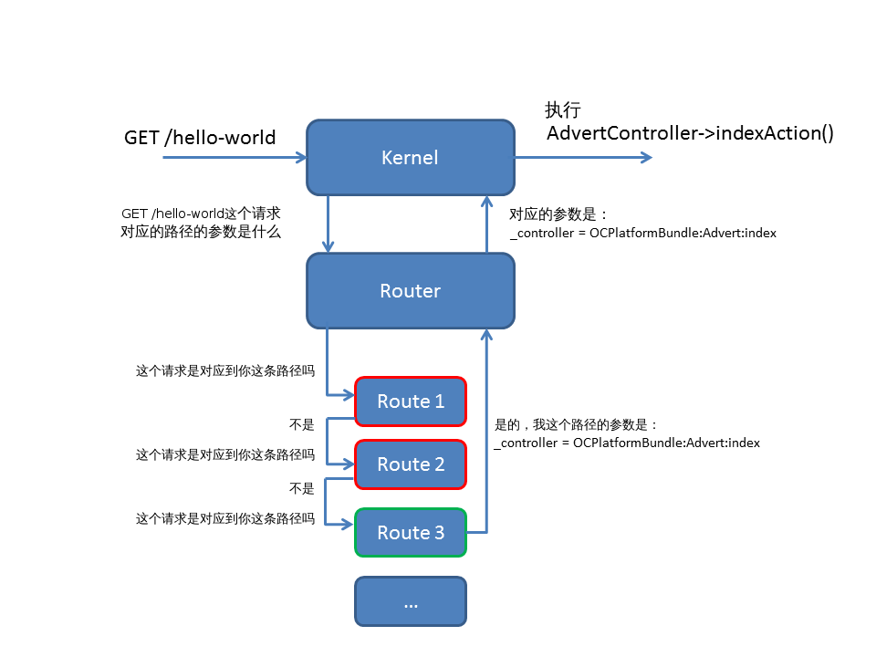

# 建立我们的路径 #

我们会在`OCPlatformBundle`这个bundle下开发，所以请切换到`src/OC/PlatformBundle`这个目录吧。

要新建一个页面，我们先要定义通过哪个URL来访问该页面。为此，我们要为这个页面新建一条路径。

## 路由？路径？ ##

### 它们的目的 ###

路由的目的是要建立一个URL和路径参数的对应关系。

比如我们有一个路径，当请求的URL是`/hello-world`时，应该执行的控制器是`Advert`（英文Advertisement的缩写）。路径里的控制器是路径必须要有的一个参数，当然它也可以有其它参数。

所以，路由的角色就是根据被请求的URL找到相应的路径，然后返回这个路径里的参数。

下面这张图概括了路由的工作方式：



我刚才说过，本章不会涉及内核和路由，目前我们只关注路径。

### 1.建立路径文件 ###

路径被定义在一个简单的文本文件里，这个文件Symfony2已经给我们的`OCPlatformBundle`创建好了。通常它被命名为对应bundle的`Resources/config/routing.yml`。打开这个文件，并把下面的内容添加进去：

``` shell
# src/OC/PlatformBundle/Resources/config/routing.yml

hello_the_world:
    path:     /hello-world
    defaults: { _controller: OCPlatformBundle:Advert:index }
```

好的，你刚刚建立了你自己的第一条路径！

> 注意这个文件里的缩进是4个空格而不是tab键！将来你犯这个错误的话（很难避免）你就会因为我为你点明了情况而感谢我，所以我现在就提醒你注意这点。我的提醒对所有`YAML`（.yml后缀）的文件都适用。

我们来简要理解下这个路径：
- `hello_the_world`是该路径的名字。你可以任意取名，它只是用来帮你以后可以容易地找到这个路径。它仅有的限制就是必须唯一。
- `path`对应了我们的“Hello World !”页面应该用哪个URL来请求。有了它这条路径才可以说：“这个URL是对应到我的，我来处理！”
- `defaults`对应了路径的参数：
    + `_controller`对应了我们要执行的action（这里是`index`）和要调用的控制器（这里是`Advert`）。一个控制器可以包含多个action，也就是说可以有多个页面。

如果你有不明白，别担心，之后会有整整一章来讨论路由并让你实践。现在有了这个文件后，我们可以继续下去了。

不过在进入下一步之前，我们来仔细分析下`_controller`的值：`OCPlatformBundle:Advert:index`，这个值被`:`分隔成了三部分：
- `OCPlatformBundle`是我们bundle的名字，Symfony2会在该bungle下找相关控制器。
- `Advert`是控制器的名字，它对应到bundle目录下的`Controller/AdvertController.php`文件，也就是我们项目根目录下的`src/OC/PlatformBundle/Controller/AdvertController.php`文件。
- `index`是控制器里要执行的方法的名字（译者注：也就是action的名字）。

### 2.把新建的路径告知给Symfony2 ###

其实不用告诉路由我们有一个新的路径了，因为它已经知道了！还记得吗，上一章里我们看到，我们bundle的路径文件已经被包含在项目的主配置文件里了（就是项目根目录下的`app/config/routing.yml`文件），所以这里没什么要做的。

事实上，我们也可以把`hello_the_world`这个路径直接放在`app/config/routing.yml`里，这样也能运行而且这么做花的时间更少。但是这却忽略了我们bundle之间解耦的原则！因为这个路径和我们要实现的广告平台bundle有关，所以它应该放在这个bundle里面而不是其它地方。请绝不要忘记这个原则。

只有这样我们的bundle才能变得独立：以后如果我们要增加，修改或者删除我们bundle里的路径，我们只要修改`src/OC/PlatformBundle/Resources/config/routing.yml`文件，而不用去碰`app/config/routing.yml`文件了。:smile:

好的，接下去我们就去创建如雷贯耳的`Advert`控制器和`index`方法吧！


