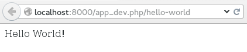

# 建立我们的控制器

## 控制器的角色

回忆一下，我们之前说过，在MVC模式里：

- 控制器是网站的“胶水”；
- 它调用所有其它的组件（数据库，表单，模板等等）来生成对应于请求的应答。
- 它包含了网站逻辑。举个例子：如果用户已经登陆而且有权限修改这篇博客文章，那我就显示修改文章的表单。

## 建立控制器

### 1.Advert控制器对应的文件

在一个bundle里，控制器都位于该bundle的`Controller`目录下。你还记得在路由里我们说过要调用名字叫`Advert`的控制器吗？包含控制器的文件命名需要遵循一个很简单的惯例：它应该以控制器名字开头，这里就是`Advert`，然后是`Controller`的后缀。具体到我们的例子，需要新建`src/OC/PlatformBundle/Controller/AdvertController.php`这个文件（这里的路径对应项目根目录）。

虽然Symfony2已经为我们建立了一个`DefaultController`控制器，但这不过是个示例，我们仍然用自己新建的控制器。请打开我们的`AdvertController.php`文件，并加入下面的代码：

``` php
<?php

// src/OC/PlatformBundle/Controller/AdvertController.php

namespace OC\PlatformBundle\Controller;

use Symfony\Component\HttpFoundation\Response;

class AdvertController
{
    public function indexAction()
    {
        return new Response("Hello World!");
    }
}
```

见证奇迹的时刻：在浏览器里打开`http://localhost:8000/app_dev.php/hello-world`！还是这个bundle，但用了自己的控制器。我们已经在正儿巴经做一些东西了！



现在，我们来快速浏览下这个文件：

- 第5行：这行是该bundle下控制器的命名空间。没什么复杂的，你只要按照控制器所在目录写就行了。
- 第7行：我们的控制器需要用到`Response`的一个实例，所以这里要用`use`来声明一下。
- 第9行：控制器的名字要和它所在文件的名字一致（后缀除外），这样自动加载才能正常工作。
- 第11行：我们定义了`indexAction()`方法。别忘了在方法名后面加上`Action`后缀。
- 第13行：我们创建一个很简单的应答。`Response`构造函数里的参数就是你发送给网站用户的网页内容，这里就是“Hello World!”。然后返回这个应答对象。

当然，显示的网页还不太漂亮，但至少我们达到了自己动手来显示“Hello World!”的目标了！

> 为什么方法名是`indexAction()`？我还是不太明白。

> 事实上，控制器的方法名需要遵循一个惯例：在路径里，我们写了`index`这个action，对应地在控制器里，我们需要定义`indexAction()`方法，也就是说控制器方法的命名规则是action的名字加上”Action“这个字符串后缀，就这么简单。其实没有什么太多绕的地方，这只不过是一个简单的惯例，用来把内核要调用的方法（就是名字行如xxxAction()的方法）和你在控制器里定义的其它方法区分开来。

把页面内容直接写在控制器的方式不是很方便，而且这样也和MVC的思想相悖。我们要用模板！


