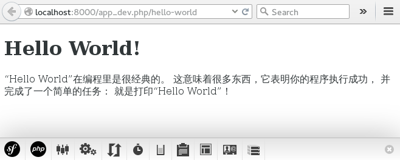

# 建立我们的Twig模板 #

## Twig模板 ##

你知道什么是模板引擎吗？它就是一段调用模板的代码。而模板就是用来动态显示HTML页面内容的文件，这些文件里不含PHP代码。你会问这是怎么做到的？其实是用模板引擎的自定义语言来实现的。每一个模板引擎都有它的自定义语言。

在Symfony2里，我们会使用Twig模板引擎。下面是一个对比，前面的代码是PHP写的模板，后面的是用Twig自定义语言写的模板。

```php
<!DOCTYPE html>
<html>
  <head>
    <title>欢迎使用Symfony2！</title>
  </head>
  <body>
    <h1><?php echo $page_title; ?></h1>

    <ul id="navigation">
      <?php foreach ($navigation as $item) { ?>
        <li>
          <a href="<?php echo $item->getHref(); ?>"><?php echo $item->getTitle(); ?></a>
        </li>
      <?php } ?>
    </ul>
  </body>
</html>
```

```twig
<!DOCTYPE html>
<html>
  <head>
        <title>欢迎使用Symfony2！</title>
  </head>
  <body>
    <h1>{{ page_title }}</h1>

    <ul id="navigation">
      
        <li><a href="{{ item.href }}">{{ item.title }}</a></li>
      
    </ul>
  </body>
</html>
```

它们看起来挺像，没错。但用Twig写的模板可读性更好！要输出一个变量，你只要写`{{ my_var }}`，而PHP里要写`<?php echo $my_var; ?>`

模板引擎的目的就是要简化前端开发人员的工作。一位前端人员未必会写PHP代码，或许也不会写Twig代码，但Twig非常容易上手，写起来快，读起来容易，而且它包含一些很有用的功能。比如说你的前端人员要把标题大写，他只要写`{{ title|upper }}`，这里`title`是包含文章标题内容的变量。它看起来可比`<?php echo strtoupper($titre); ?>`优雅多了，不是吗？

在专门讨论Twig的章节里，我们会看到它提供的很多功能可以简化开发。现在我们继续来改进我们的“Hello World !”程序。

## 在Symfony2里使用Twig ##

既然把页面内容直接写在控制器里不好，那我们如何在控制器里调用Twig模板呢？

### 1.建立模板文件 ###

在一个bundle里，模板（或者说视图）的目录位于`Resources/views`下。这里我们仍然不会使用Symfony2自动为我们生成的`Default`目录。请创建`Advert`目录并且在该目录下创建`index.html.twig`文件。这样，我们就有了`src/OC/PlatformBundle/Resources/views/Advert/index.html.twig`文件。

我们来把此路径里`Advert/index.html.twig`这一部分单独拿出来研究下：

- `Advert`是目录的名字，它和我们之前写的控制器的名字是一样的，这样方便我们查找（这不是必须的，但强烈推荐这样做，这样`Advert`控制器里的所有方法对应使用这个`Advert`目录下的视图）。
- `index`是模板的名字，它和我们之前写的控制器里的方法名字一样（同样，这不是必须的，但非常推荐）。
- `html`对应到我们模板的内容格式，这里我们用的是HTML格式，但你以后也可能会使用XML或其它格式，到时你只要修改对应的后缀。这样组织名字也是为了方便查找。
- `twig`是我们模板的格式，这里我们用Twig作为模板引擎，但你也可以直接使用原生PHP的模板。

回到我们刚刚新建的Twig模板，加入下面内容：

```twig
{# src/OC/PlatformBundle/Resources/views/Advert/index.html.twig #}

<!DOCTYPE html>
<html>
    <head>
        <title>Bienvenue sur ma première page avec OpenClassrooms !</title>
    </head>
    <body>
        <h1>Hello World !</h1>
        
        <p>
            Le Hello World est un grand classique en programmation.
            Il signifie énormément, car cela veut dire que vous avez
            réussi à exécuter le programme pour accomplir une tâche simple :
            afficher ce hello world !
        </p>
    </body>
</html>
```

在这个模板里，我们没有使用变量或是Twig的自定义结构。事实上这只是个包含纯HTML代码的简单文件。


### 2.从控制器里调用该模板 ###

现在只需要调用这个模板了，那是控制器该做的事情，所以我们在`indexAction()`方法里来调用模板。

为了可以访问管理模板的方法，我们的控制器需要继承Symfony里的基础控制器，这个基础控制器实现了很多很方便的方法供子类使用，我们之后的课程里会一直用到。注意下下面代码里的继承部分。

我们用来获取模板生成内容的具体方法是`$this->get('templating')->render()`。这个方法的参数是模板名，返回模板生成的内容。以下是修改后的控制器代码：

```php
<?php

// src/OC/PlatformBundle/Controller/AdvertController.php

namespace OC\PlatformBundle\Controller;

// 别忘了使用use :
use Symfony\Bundle\FrameworkBundle\Controller\Controller;
use Symfony\Component\HttpFoundation\Response;

class AdvertController extends Controller
{
  public function indexAction()
  {
    $content = $this->get('templating')->render('OCPlatformBundle:Advert:index.html.twig');
    return new Response($content);
  }
}
```

我们的控制器只是继承了Symfony2提供的基础控制器，然后加了一行获取模板生成内容的代码。

定义模板名的惯例和定义控制器名的惯例是一样的：`NameOfBundle:NameOfController:NameOfAction`。然后我们修改了创建`Response`实例的代码，把新加的`$content`变量传给`Response`的构造函数，而不再是硬编码的“Hello World !”了。

> 怎么理解`$this->get('templating')`这段代码？
> 好问题！在控制器里形如`$this->get('my_service')`的函数调用会返回一个名叫`my_service`的对象，这个对象可以用来完成一些任务。例如这里的`templating`对象可以通过它的`render`方法来获取模板生成的内容。这些称之为“服务（service）”的对象是Symfony框架里非比寻常的特色。我们之后会有专门的章节详细讨论它。目前请耐心等等，你只要知道怎么使用这些对象，而先不用管它们是怎么来的。

在浏览器里我们还是进入`http://localhost:8000/app_dev.php/hello-world`这个地址，请看变化：



> 请留意页面底部的工具栏。我已经告诉过你：当在开发环境下，Symfony2检测到关闭标签`</body>`时，就会自动加上工具栏。正是因为这个原因我们之前的“Hello World !”例子里没有出现工具栏。

你想要试试倒腾一下Twig的变量吗？请修改控制器，在`render()`方法里增加进第二个参数，这个参数是一个关联数组，其中元素的键是变量名，元素的值是变量值。

```php
<?php

$content = $this
    ->get('templating')
    ->render('OCPlatformBundle:Advert:index.html.twig', [
        'name' => 'Symfony'
    ]
);
```

接着，修改模板代码，把`<h1>`标签改成下面的内容：

```twig
<h1>Hello {{ name }} !</h1>
```

完成！刷新下页面。你看到变化了吧！在专门讨论Twig的章节里，我们再具体讨论模板变量的传递。

